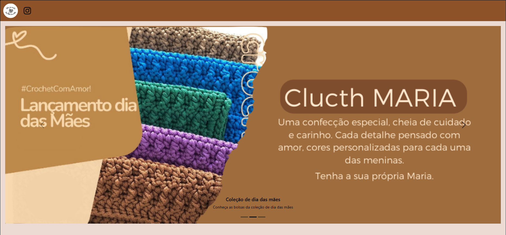
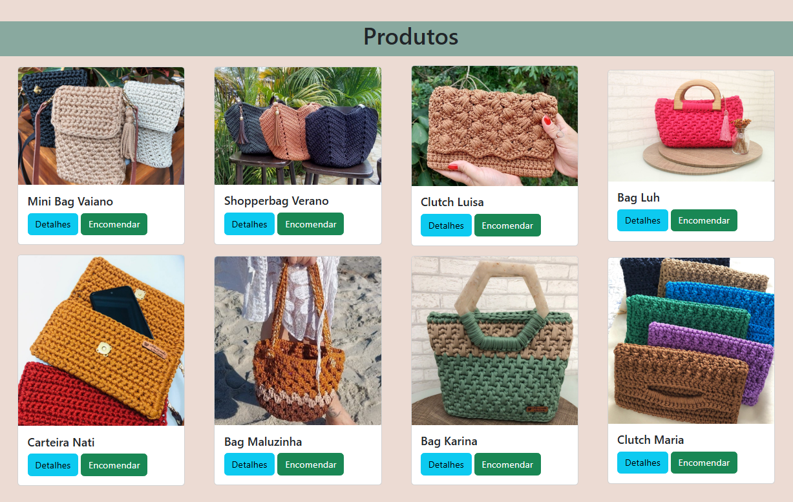
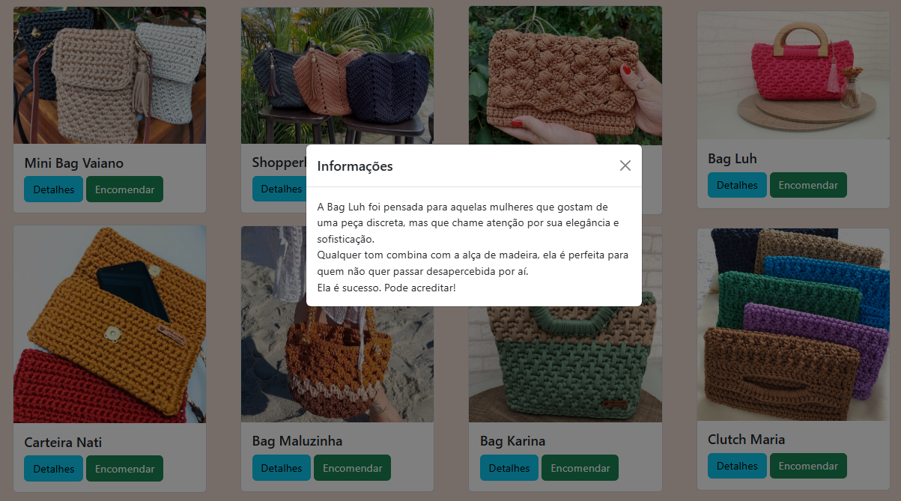

# Projeto Croche

Este projeto consiste em um website desenvolvido com HTML / CSS / JavaScript / Bootstrap para um trabalho estudantil destinado a uma empreendedora que vende bolsas artesanais em crochê.

## Autores
Este projeto educacional foi desenvolvido por:
- Gustavo de Oliveira - [@gutt06](https://github.com/gutt06)
- Laís Carvalho - [@LaysC](https://github.com/LaysC)

## Aprendizados
Este foi o início da minha jornada como desenvolvedor web, neste projeto eu iniciei meus estudos de como construir um website pela primeira vez utilizando apenas HTML e CSS com a utilização de Bootstrap com JavaScript funcional. Meu principal desafio neste projeto foi como estruturar visualmente os elementos no site para que o design fosse interessante e chamar a atenção de possíveis clientes. E para superar este desafio busquei analisar e entender como grandes empresas estruturavam visualmente o conteúdo de seus websites e chamavam a atenção de seus clientes, e assim implementei estes elementos no meu projeto.

## Website

    
    
    

